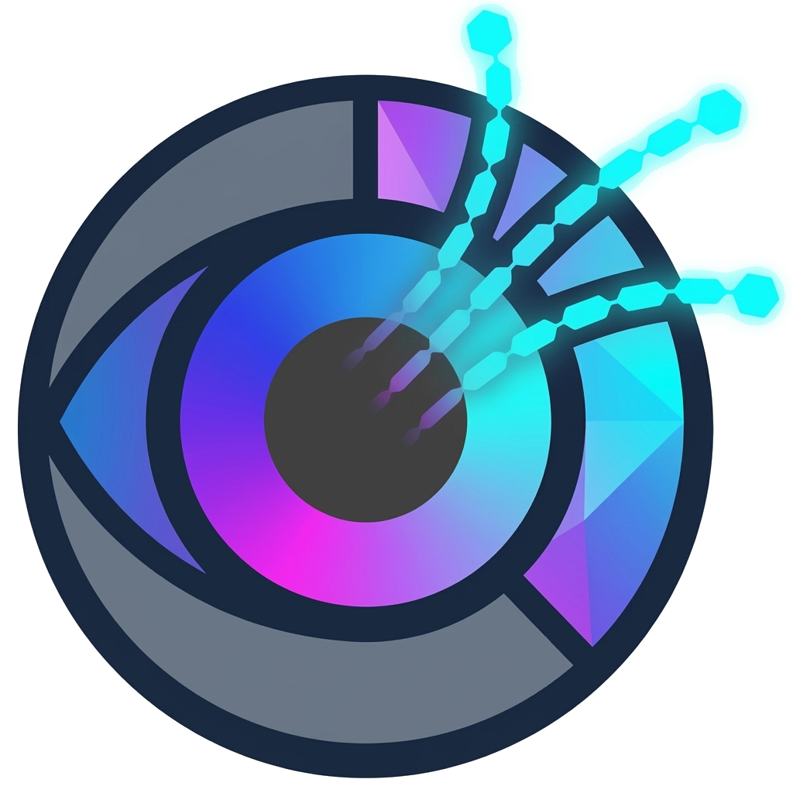
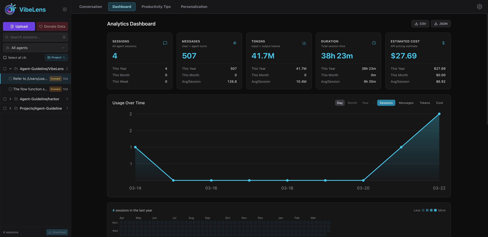
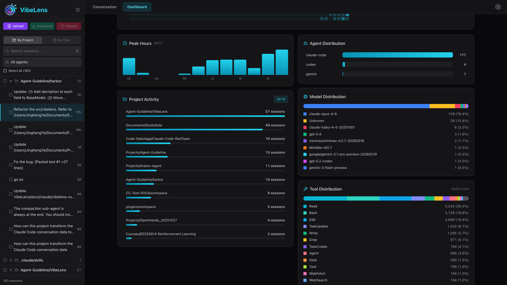
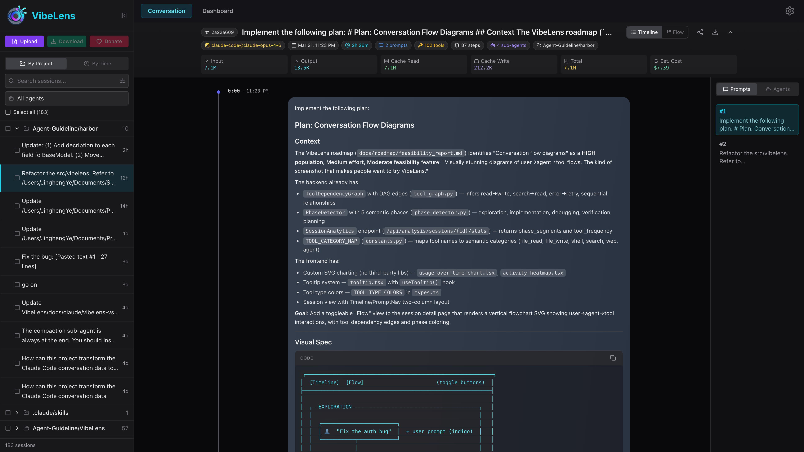
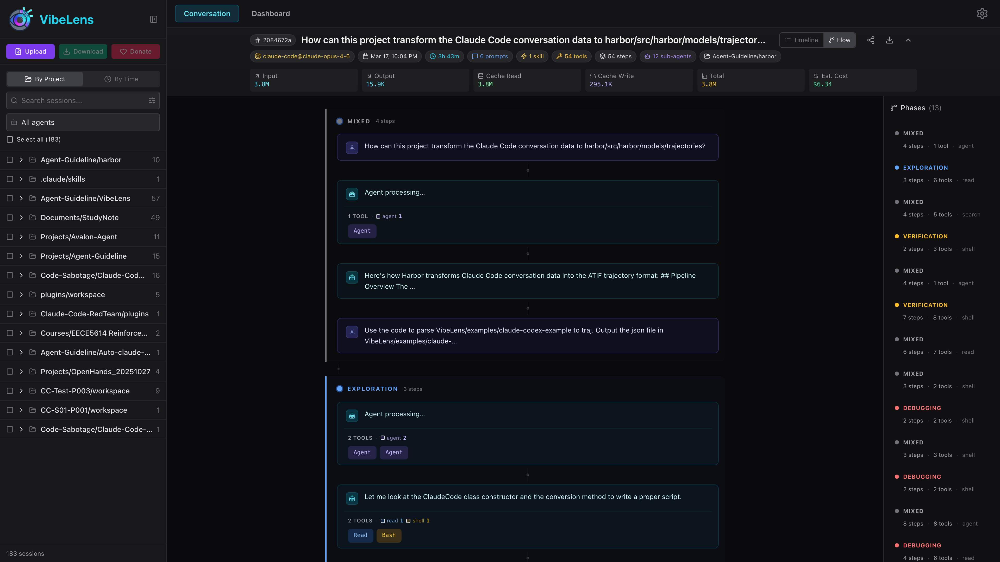

<p align="center">
  
</p>

<h1 align="center">VibeLens</h1>

<p align="center">
  <strong>See what your AI coding agents are actually doing.</strong>
</p>

<p align="center">
  <a href="https://pypi.org/project/vibelens/"></a>
  <a href="https://pypi.org/project/vibelens/"></a>
  <a href="https://opensource.org/licenses/MIT"></a>
  <a href="https://vibelens.chats-lab.org/"></a>
</p>

<p align="center">
  <a href="https://vibelens.chats-lab.org/">Live Demo</a> &middot;
  <a href="#quick-start">Quick Start</a> &middot;
  <a href="https://pypi.org/project/vibelens/">PyPI</a> &middot;
  <a href="CHANGELOG.md">Changelog</a>
</p>

---

VibeLens parses, visualizes, and analyzes conversation histories from **Claude Code**, **Codex CLI**, **Gemini CLI**, and **Dataclaw** — giving you full observability into your AI-assisted development workflow.

One command. No config. Works with your local `~/.claude/` sessions out of the box.

```bash
pip install vibelens && vibelens serve
```









## Why VibeLens?

- **What did my agent actually do?** Step-by-step timeline with tool calls, token counts, and elapsed time
- **How much is it costing me?** Per-session and aggregate cost estimation across 45+ models from 12 providers
- **Where are the bottlenecks?** Conversation flow diagrams with phase detection and tool dependency graphs
- **How do I share a session?** Shareable permalink URLs with read-only session replay
- **What are my usage trends?** Analytics dashboard with heatmaps, model distribution, and project breakdowns

## Features

| Feature | Description |
|---------|-------------|
| **Multi-agent parsing** | Claude Code, Codex CLI, Gemini CLI, Dataclaw with auto-detection |
| **Step timeline** | Tool calls, sub-agent spawns, elapsed time, image content |
| **Cost estimation** | 45+ models, 12 providers, per-session and aggregate cost |
| **Flow diagrams** | Phase-grouped conversation flow with tool dependency highlighting |
| **Session sharing** | Shareable permalink URLs with read-only view |
| **Analytics dashboard** | Stat cards, usage trends, activity heatmap, model distribution |
| **Tool distribution** | Per-tool call counts, error rates, avg/session |

## Quick Start

### Install and run

```bash
pip install vibelens
vibelens serve
```

Or run without installing:

```bash
uvx vibelens serve
```

VibeLens opens your browser and reads your local `~/.claude/` sessions by default.

### Development install

```bash
git clone https://github.com/yejh123/VibeLens.git
cd VibeLens
uv sync --extra dev
uv run vibelens serve
```

### Configuration

YAML-based configuration with environment variable overrides (`VIBELENS_*`). See [`config/vibelens.example.yaml`](config/vibelens.example.yaml) for all options.

```bash
# Use a config file
vibelens serve --config config/self-use.yaml

# Override host/port
vibelens serve --host 0.0.0.0 --port 8080
```

## Supported Agents

| Agent | Format | Data Location |
|-------|--------|---------------|
| **Claude Code** | JSONL | `~/.claude/projects/` |
| **Codex CLI** | JSONL | `~/.codex/sessions/` |
| **Gemini CLI** | JSON | `~/.gemini/tmp/` |
| **Dataclaw** | JSONL | HuggingFace exports |

## Data Donation

VibeLens supports donating your agent conversation data to advance research on coding agent behavior. Donated sessions are collected by [CHATS-Lab](https://github.com/CHATS-lab) (Conversation, Human-AI Technology, and Safety Lab) at Northeastern University.

To donate, upload your data, select the sessions you want to share, and click the **Donate** button.

## Development

```bash
# Lint and test
uv run ruff check src/ tests/
uv run pytest tests/ -v -s

# Frontend dev server (hot reload)
cd frontend && npm install && npm run dev
```

## Contributing

Contributions are welcome! Please ensure code passes `ruff check` and `pytest` before submitting.

## License

[MIT](LICENSE)
