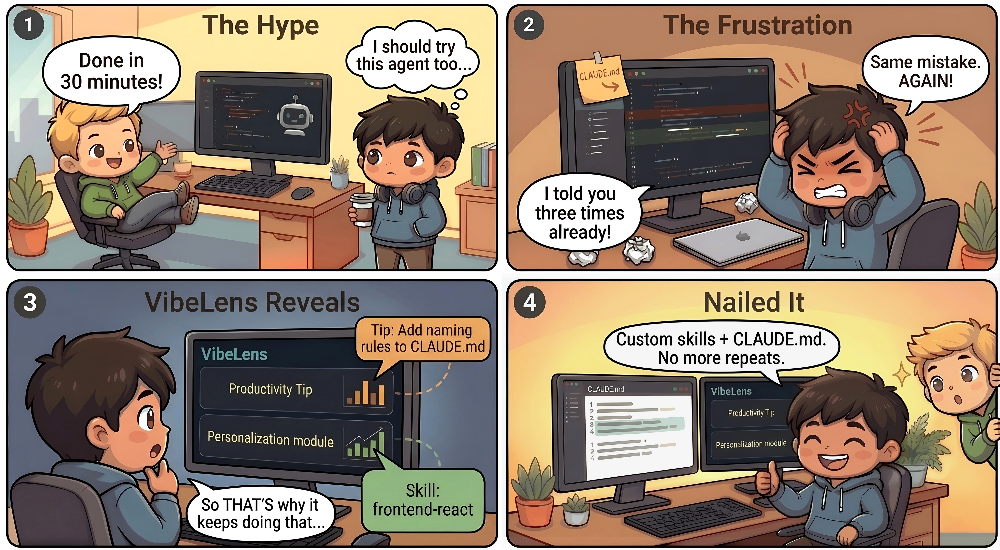

<p align="center">
  
</p>

<h1 align="center">VibeLens</h1>

<p align="center">
  <strong>See what your AI coding agents are actually doing.</strong><br>
  Replay. Analyze. Evolve.
</p>

<p align="center">
  <a href="https://pypi.org/project/vibelens/"></a>
  <a href="https://pypi.org/project/vibelens/"></a>
  <a href="https://opensource.org/licenses/MIT"></a>
  <a href="https://vibelens.chats-lab.org/"></a>
</p>

<p align="center">
  <a href="https://vibelens.chats-lab.org/">Live Demo</a> &middot;
  <a href="#quick-start">Quick Start</a> &middot;
  <a href="#supported-agents">Supported Agents</a> &middot;
  <a href="https://pypi.org/project/vibelens/">PyPI</a> &middot;
  <a href="CHANGELOG.md">Changelog</a>
</p>

---

<p align="center">
  
</p>

<p align="center"><em>Understand your agent. Teach it. Master it.</em></p>

---

Your AI coding agents run hundreds of tool calls, burn thousands of tokens, and you have no idea what happened. VibeLens changes that.

```bash
pip install vibelens && vibelens serve
```

One install. Reads local logs. Works with **Claude Code**, **Codex CLI**, **Gemini CLI**, and **OpenClaw** out of the box.

## Features

| Feature | Description |
|---------|-------------|
| **Session visualization** | Step-by-step timeline with tool calls, thinking blocks, sub-agent spawns, and flow diagrams |
| **Dashboard analytics** | Usage heatmaps, cost breakdowns by model, peak-hour histograms, per-project drill-downs |
| **Productivity tips** | Spots retry loops, circular debugging, abandoned approaches across sessions |
| **Personalization** | Retrieve, customize, and evolve reusable skills from your real sessions |
| **Session sharing** | One-click shareable links for team review |
| **Multi-agent support** | Claude Code, Codex CLI, Gemini CLI, OpenClaw with auto-detection |

## Supported Agents

| Agent | Format | Data Location |
|-------|--------|---------------|
| **Claude Code** | JSONL | `~/.claude/projects/` |
| **Codex CLI** | JSONL | `~/.codex/sessions/` |
| **Gemini CLI** | JSON | `~/.gemini/tmp/` |
| **OpenClaw** | JSONL | `~/.openclaw/agents/` |

VibeLens auto-detects the agent format. Just point it at your session directory and it works.

## Screenshots

### Session Visualization & Dashboard Analytics

<table>
  <tr>
    <td width="50%">
      <kbd></kbd>
      <p align="center"><b>Session Visualization</b><br>Step-by-step timeline with messages, tool calls, thinking blocks, and sub-agent spawns.</p>
    </td>
    <td width="50%">
      <kbd></kbd>
      <p align="center"><b>Dashboard Analytics</b><br>Usage heatmaps, cost breakdowns by model, and per-project drill-downs.</p>
    </td>
  </tr>
</table>

### Productivity Tips & Personalization

<table>
  <tr>
    <td width="50%">
      <kbd></kbd>
      <p align="center"><b>Productivity Tips</b><br>Detect friction patterns and get concrete suggestions to improve your workflow.</p>
    </td>
    <td width="50%">
      <kbd></kbd>
      <p align="center"><b>Skill Recommendation</b><br>Match workflow patterns to pre-built skills from the catalog.</p>
    </td>
  </tr>
  <tr>
    <td width="50%">
      <kbd></kbd>
      <p align="center"><b>Skill Customization</b><br>Generate new SKILL.md files tailored to your session patterns.</p>
    </td>
    <td width="50%">
      <kbd></kbd>
      <p align="center"><b>Skill Evolution</b><br>Evolve installed skills with targeted edits based on your real sessions.</p>
    </td>
  </tr>
</table>

## Quick Start

### Install and run

```bash
pip install vibelens
vibelens serve
```

Or run without installing:

```bash
uvx vibelens serve
```

VibeLens opens your browser and reads your local `~/.claude/` sessions by default.

### Development install

```bash
git clone https://github.com/yejh123/VibeLens.git
cd VibeLens
uv sync --extra dev
uv run vibelens serve
```

### Configuration

YAML-based configuration with environment variable overrides (`VIBELENS_*`). See [`config/vibelens.example.yaml`](config/vibelens.example.yaml) for all options.

```bash
# Use a config file
vibelens serve --config config/self-use.yaml

# Override host/port
vibelens serve --host 0.0.0.0 --port 8080
```

## Data Donation

VibeLens supports donating your agent session data to advance research on coding agent behavior. Donated sessions are collected by [CHATS-Lab](https://github.com/CHATS-lab) (Conversation, Human-AI Technology, and Safety Lab) at Northeastern University.

To donate, upload your data, select the sessions you want to share, and click the **Donate** button.

## Contributing

Contributions are welcome! Please ensure code passes `ruff check` and `pytest` before submitting.

## License

[MIT](LICENSE)
