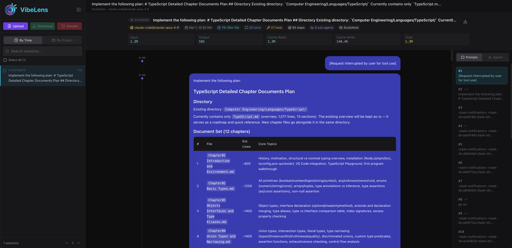
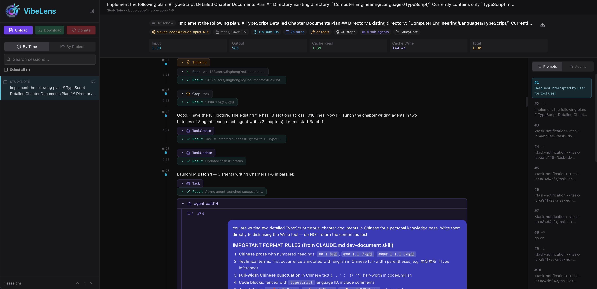

# VibeLens

Agent trajectory analysis and visualization platform. Parses, normalizes, and visualizes conversation histories from coding agent CLIs using the [ATIF v1.6](https://github.com/harbor-framework/harbor/blob/main/docs/rfcs/0001-trajectory-format.md) trajectory model.





## Features

- **Multi-agent parsing** — Claude Code, Codex CLI, Gemini CLI, and Dataclaw formats with auto-detection
- **Step timeline** — Visual timeline with elapsed time, tool call details, and sub-agent spawn indicators

## Quick Start

### Prerequisites

- Python 3.12+
- [uv](https://docs.astral.sh/uv/) package manager
- Node.js 18+ (only for frontend development)

### Install and run

```bash
git clone https://github.com/yejh123/VibeLens.git
cd VibeLens
uv sync
uv run vibelens serve
```

Open http://127.0.0.1:12001 in your browser. VibeLens reads your local `~/.claude/` sessions by default.

### Configuration

YAML-based configuration with environment variable overrides (`VIBELENS_*`). See [`config/vibelens.example.yaml`](config/vibelens.example.yaml) for all options.

```bash
# Use a config file
uv run vibelens serve --config config/self-use.yaml

# Override host/port
uv run vibelens serve --host 0.0.0.0 --port 8080
```

## Data Donation

VibeLens supports donating your agent conversation data to advance research on coding agent behavior. Donated sessions are collected by [CHATS-Lab](https://github.com/CHATS-lab) (Conversation, Human-AI Technology, and Safety Lab) at Northeastern University.

We welcome contributions of real-world coding agent trajectories across all supported formats. Your data helps the research community better understand how developers interact with AI coding assistants.

To donate, upload your data, select your sessions, and click the **Donate** button.

## Development

```bash
# Lint and test
uv run ruff check src/ tests/
uv run pytest tests/ -v -s

# Frontend dev server (hot reload)
cd frontend && npm install && npm run dev
```

## Contributing

Contributions are welcome! Please ensure code passes `ruff check` and `pytest` before submitting.
